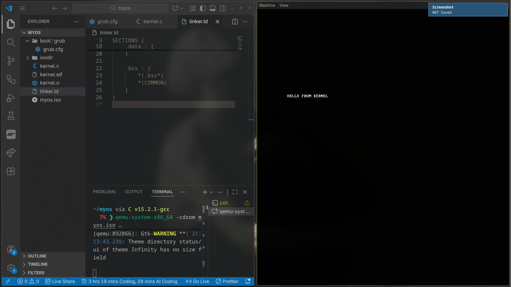

# My OS Build Notes

*i spent TWO DAYS just to see this*

- tried building from bootlaoder but that wasso hard since i didnit know how to jump to the kernel @ from .asm file i gave up(even chatgpt/reddit/stackoverflow couldnt help me) so now we are starting from grub + kernel why does it work tho u may ask 👀👀👀👀??
- grub replcae bootloader file  / deal with BIOS disk managment / GUESSE WHERE THE KERNEL IS LOCATED IN THE DISK AND JUMP TO IT auto which u have to find agreeble MEM between bootloder file and kernel if u wenna do it 
- here is currentw workflow

BIOS / UEFI  
   ↓  
GRUB (stage1 → stage2)  
   ↓  
Your C code runs