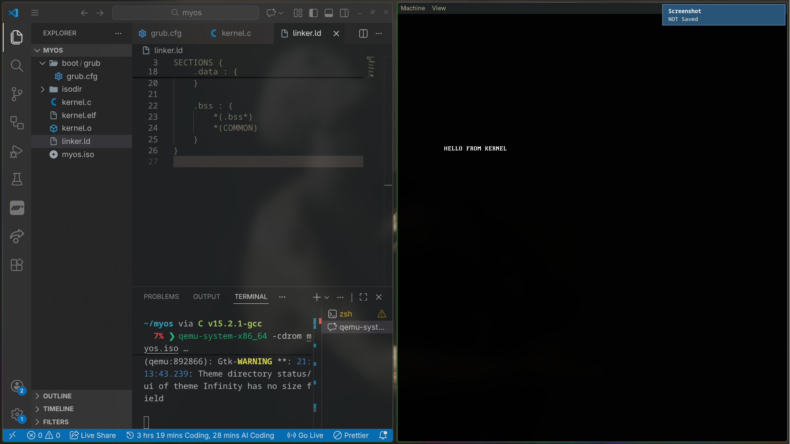
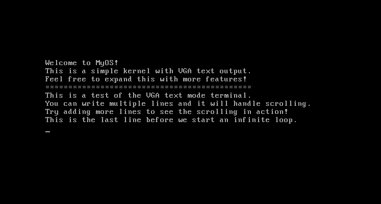
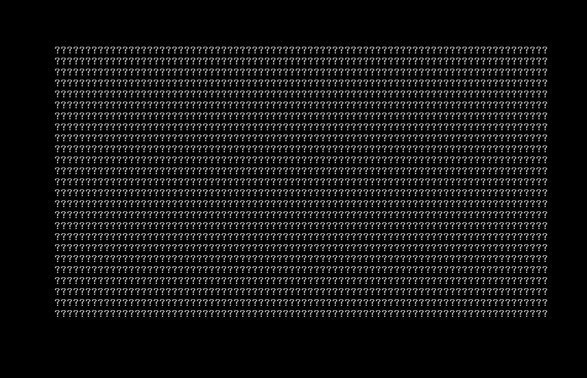

# My OS Build Notes

## STEP 01 : Getting the kernel to run
*i spent TWO DAYS just to see this*



- tried building from bootlaoder but that wasso hard since i didnit know how to jump to the kernel @ from .asm file i gave up(even chatgpt/reddit/stackoverflow couldnt help me) so now we are starting from grub + kernel why does it work tho u may ask 👀👀👀👀??
- grub replcae bootloader file  / deal with BIOS disk managment / GUESSE WHERE THE KERNEL IS LOCATED IN THE DISK AND JUMP TO IT auto which u have to find agreeble MEM between bootloder file and kernel if u wenna do it 
- here is currentw workflow
```
BIOS / UEFI  
   ↓  
GRUB (stage1 → stage2)  
   ↓  
Your C code runs
```

## multiboot header :
```
__attribute__((section(".multiboot")))
const uint32_t multiboot_header[] = {
    0x1BADB002,
    0x0,
    -(0x1BADB002)
};
```

| Value           | Meaning                |
| --------------- | ---------------------- |
| `0x1BADB002`    | Multiboot magic number |
| `0x0`           | Flags                  |
| `-(0x1BADB002)` | Checksum               |

- checksum : is calculated as the negative sum of the magic number and flags, ensuring that the total sum of the three values is zero. This allows the bootloader to verify that the header is valid and correctly formatted.
- Flags : can be set to indicate specific features or requirements for the bootloader, such as whether it should provide a memory map or load additional modules.
- magic number : is a specific value that identifies the header as a multiboot header, allowing the bootloader to recognize it and proceed with loading the kernel accordingly.

## RAAM usage so far : 
| Item           | Where It Lives   |
| -------------- | ---------------- |
| Code           | RAM (.text)      |
| Strings        | RAM (.rodata)    |
| uptime_seconds | RAM (.data)      |
| buffer[20]     | Stack            |
| VGA memory     | Physical 0xB8000 |

### Structure so far : 
```
Power ON
   ↓
BIOS
   ↓
GRUB
   ↓
GRUB loads kernel into RAM
   ↓
GRUB jumps to kernel_main
   ↓
Print HELLO
   ↓
Loop:
   → update_clock()
   → increment uptime
   → delay
   → repeat forever
```

## STEP 02 Terminal Initialization & Hardware Cursor: 


- we start by creating some helper functions to write to the VGA text buffer, which is located at physical address `0xB8000`. Each character on the screen is represented by two bytes: one for the ASCII character and one for the color attribute.
- we define a function `terminal_putentryat` that takes a character, its color, and the x and y coordinates on the screen. This function calculates the appropriate index in the VGA buffer and writes the character and color to that location.
- we also define a function `terminal_putchar` that takes a character and writes it to the current cursor position, updating the cursor position accordingly. If the cursor reaches the end of the line, it moves to the next line.
- to initialize the terminal, we create a function `terminal_initialize` that clears the screen by filling the VGA buffer with spaces and sets the initial cursor position to the top-left corner.
- for the hardware cursor, we define a function `update_cursor` that calculates the cursor's position based on the current x and y coordinates and writes this position to the VGA controller's I/O ports. This allows the hardware cursor to move in sync with the text being printed on the screen.
- we also implement a function `terminal_scroll` that scrolls the terminal up by one line when the cursor reaches the bottom of the screen, ensuring that new text can continue to be displayed without overwriting existing content.

- **main** ; then we just print the output using command terminal_write and update the cursor position using update_cursor function.

- same structure as before just instead of using VGA memory directly we are using helper functions to write to it and update the cursor position.

- **Next Step** : wenna add keyboard input hadnler by after that am gonna add shell for terminal or sum
- Memory used so far :
| Memory Area                   | Address Range (approx)  | Size          | Content / Usage                                             |
| ----------------------------- | ----------------------- | ------------- | ----------------------------------------------------------- |
| **Kernel Code (.text)**       | 0x00100000 – 0x00101FFF | ~8 KB         | `kernel_main()`, `terminal_*()` functions                   |
| **Read-Only Data (.rodata)**  | 0x00102000 – 0x001023FF | ~1 KB         | Strings (`"Welcome to MyOS!"`), Multiboot header            |
| **Initialized Data (.data)**  | 0x00102400 – 0x001024FF | ~256 B        | `terminal_row`, `terminal_column`, `terminal_color`         |
| **Uninitialized Data (.bss)** | 0x00102500 – 0x001025FF | ~256 B        | Empty globals (none yet, reserved space)                    |
| **Stack**                     | 0x00103000 – 0x00103FFF | ~4 KB         | Function call frames, local buffers                         |
| **Heap (future)**             | 0x00104000 – 0x0010FFFF | ~48 KB        | Not used yet                                                |
| **VGA Memory**                | 0x000B8000 – 0x000B8FFF | 4 KB          | Text characters + colors (80×25 screen)                     |
| **I/O Ports**                 | N/A                     | N/A           | 0x3D4, 0x3D5 → hardware cursor; future ports keyboard/timer |
| **Unused / free RAM**         | 0x00110000+             | Remaining RAM | Not used yet                                                |
| **Total (approx)**            | —                       | ~65 KB + VGA  | Sum of kernel code + data + stack + heap + VGA              |

## Keyboard Input Handler :
- PS/2 : The PS/2 protocol is a bidirectional, synchronous serial communication interface used primarily for keyboards and mice, utilizing two lines: Data and Clock, with 5V TTL logic. It employs an 11-bit frame (start bit, 8 data bits, odd parity, stop bit) for communication. While the device generates the clock, the host controls the bu 


- output : 


